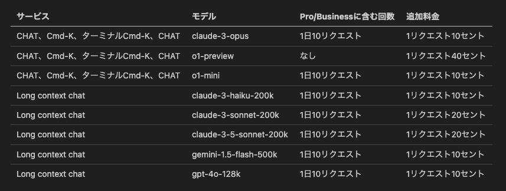

# 📕 第1章 Cursor の導入

## 📗 Cursor の概要（P2）

本書内では OpenAI などからの Anysphere 社への出資の紹介をしていますが、2024年8月22日に、Stripe、Github、Ramp、Perplexity、OpenAI の創設者などから、さらに6000万ドル（約88億円）の出資があったことが公式にアナウンスされました。心強いニュースですね。
- [We Raised $60M](https://www.cursor.com/blog/series-a)

## 📗 Cursorの料金体系（P3）

- 「高速 GTP-4」という呼び方から「高速プレミアムモデル」に変更になっています。
- 「高速プレミアムモデル」には下記モデルが含まれます。
    1. gpt-4
    2. gpt-4o
    3. claude-3.5-sonnet
    4. claude-3-5-sonnet-20241022
    5. claude-3.5-haiku
    8. gemini-2.0-flash-exp
    9. gemini-2.0-flash-thinking-exp
    10. gemini-exp-1206
    11. deepseek-v3
    12. deepseek-r1

- deepseek モデルはプレミアムモデルではあっても、使用しても高速リクエスト枠が消費されないようです（2025/1/29時点）。
- claude-3.5-haiku は1回のプレミアムリクエストの1/3としてカウントされます。
- Pro/Business プランに含まれていない上限回数、追加料金のあるモデルは、次の表のようになっています（2024/10/17時点）

- GPT-4o mini は料金体系上 cursor-small と同じ扱い（Pro 以上は回数制限なし）になっています（コストパフォーマンスが良いので、活用の価値が高い）。
