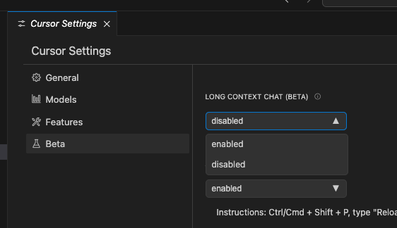
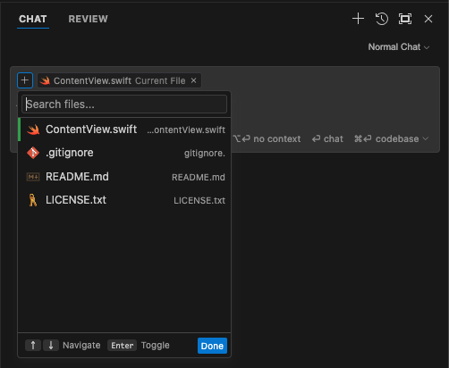
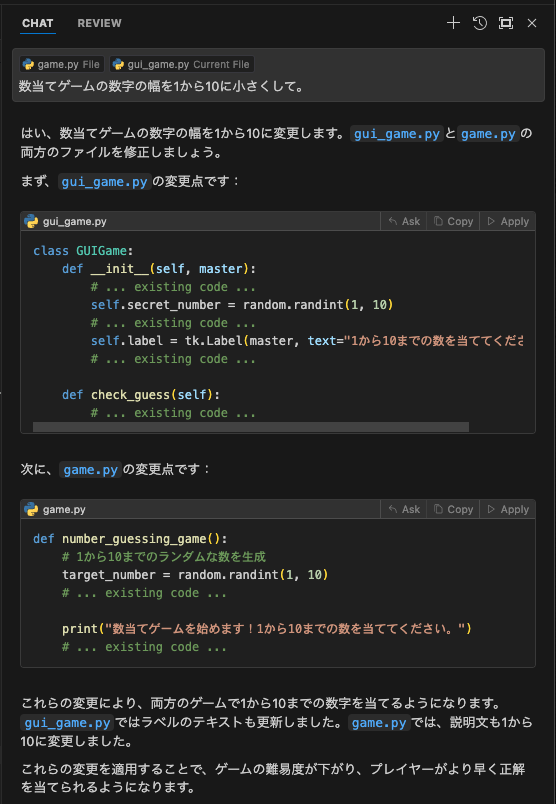
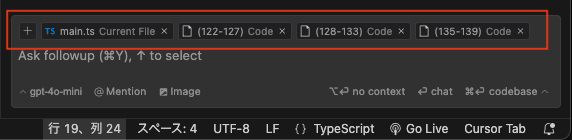
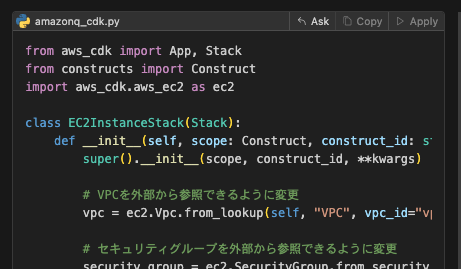
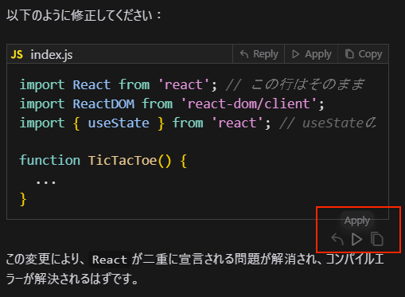
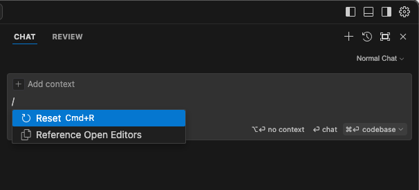

# 📕 第3章 Cursor の機能説明

原稿を書き上げた後の変更点について補足説明します。

## 📘 3.1 Chat（AIチャット機能）

## 📘 ▼チャットモードの切り替え / 3.2 Interpreter Mode

チャットモードのプルダウンが表示されない場合、P.127を参照して「LONG CONTEXT CHAT (BETA)」の設定を「enabled」（有効）にしてください。

Interpreter Mode は、0.40 からチャットモードのプルダウンで表示されなくなりましたが、Long Context Chat の設定が「disabled」（無効）の状態だと、選択できるチャットモードが Normal Chat しかなくなるためか（選択不要）、プルダウン自体の表示がなくなるようです。

Interpreter Mode が表示されなくなったことについては、廃止のアナウンスはありませんが、公式フォーラムで Interpreter Mode の不調に対して Composer で代替するアドバイスが Anysphere メンバーから付いていることから、廃止になった可能性があります。

「追補」に記載した Composer はファイルの作成ができるので、大きくなったファイルのモジュール分けなどのタスクは代替が可能です。一方、生成されたコードの実行を代替する手段はないため、Normal Chat モードで生成したコードをファイトして保存して手動で実行する操作が必要になります。

以降の章で、Interpreter Mode を使用している場面では、この点を踏まえてお読み替えください。

## 📘 チャット画面の刷新

0.40 でチャットの画面や操作性が刷新され、ファイルピッカーが追加されました。

ファイルピッカーは、新機能の Composer （※追補で説明）で実装されている機能で、更新対象を指定する機能です。

この後に説明する@によるシンボル参照が文字通り「参照用」の情報であることに対して、ファイルピッカーで選択されたファイルは「更新対象」としての意味も持ちます。

現状、Composer と異なり、複数ファイルに対して一括更新を確定することはできません。各ファイルごとに「Apply」操作を実行する必要はあります。

また、チャットの回答欄下に表示される箱型アイコンをクリックすると、チャットの内容を継承した Composer を呼び出すことができます。

「WILL USE」「USED」欄で表示されていた参照情報が、更新対象ファイルと並列で表示されるようになったようです（見分けが難しくなったかもしれません）。

各参照情報をクリックして、内容を拡大表示、折りたたみができます。
また、以前は手動で指定した参照以外は削除できませんでしたが、各参照に×マークが付いて自由に削除できるようになりました。

## 📘「Docs参照」

カスタム Docs のリスト内にインデックスされた日付、時刻が表示されるようになりました。

ギアアイコンをクリックすると、設定画面の「Features」タブ内でカスタム Docs の設定が表示されます（設定画面でインデックスを更新することができます）。

## 📘「Lint error参照」

0.34.2以降、@Lint error は表示されなくなっています。この現象については、公式フォーラム、公式リポジトリで不具合で修正を行なっていると説明されていますが、現在のところ修復はされていません。

- https://forum.cursor.com/t/is-lint-errors-gone-in-0-34-2/5427
- https://github.com/getcursor/cursor/issues/1470

## 📘「Apply」、「Copy」、 「Reply」ボタン

- 0.40 でボタンの並び順が変更になっています。
- 「Reply」ボタンは「Ask」ボタンにラベルが変更になっています。機能的には変更ありません。
- 「Apply」ボタンは、GPT、Claude、Gemini の主要モデルで動作するようになりました（公式のアナウンスはありませんが、手元での動作検証の結果です）。
    - 「Apply」は Cursor のカスタムモデルを使っているため、API キーを使用して Cursor に課金していない状態では実行できません。

提案されたコードブロックの下に淡く表示されていた「Apply」、「Reply」、「Copy」ボタン（以下の図参照）が表示されなくなっています。

## 📘 /edit コマンド

/edit コマンドは 0.40 で廃止になった模様です。
現在は新しいコマンドが追加され、CHAT、Composer のプロンプト入力欄で / 記号を入力すると、「Reset」、「Reference Open Editers」コマンドが表示されます。

- 「Reset」コマンド：その CHAT、Composer のセッション情報がリセットされます（空の CHAT、Composer になります）。
- 「Reference Open Editers」コマンド：エディターで開いているファイルがまとめて、ファイルピッカーで選択される操作になります。
