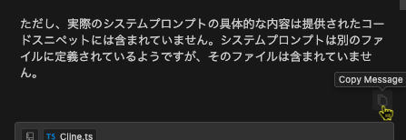
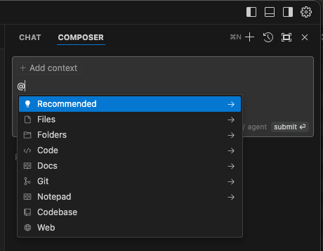
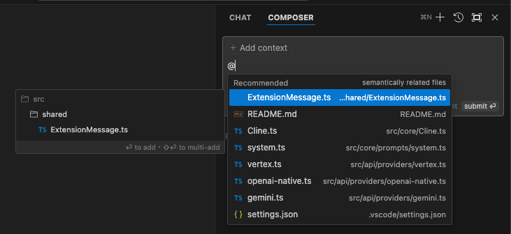

# 📕 第3章 Cursor の機能説明

原稿を書き上げた後の変更点について補足説明します。

## 📘 3.1 Chat（AIチャット機能）

## 📘 ▼チャットモードの切り替え 🌟New🌟

Interpreter Mode はバージョン 0.40 で、Long Context Chat は 0.43 で廃止になり、チャットモードの切り替えの機能は廃止になりました（プルダウンは表示されません）。
- Interpreter Mode はより強化された機能として、Composer の agent モードが実装されました。以降の章で、Interpreter Mode を使用している場面では、Composer agent をお使いください。Composer agent については、[第6章](../chapter6/README.md)の説明をご覧ください。
- Long Context Chat 廃止後、各モデルのコンテキストウィンドウまでチャットや Composer がデータを送受信できるかについては公式なアナウンスがないため、現時点では不明です。

## 📘 モデル選択

モデル選択のプルダウン上に「Search...」欄が追加され、モデル名の部分一致で検索ができるようになりました。多数のモデルのリストからモデルを切り替える際に便利です。この操作は、CHAT、Command K、Composerのいずれでも可能です。

## 📘 ファイルピッカーの追加

0.40 でチャットの画面や操作性が刷新され、ファイルピッカーが追加されました。

ファイルピッカーは、新機能の Composer （※追補で説明）で実装されている機能で、更新対象を指定する機能です。

この後に説明する@によるシンボル参照が文字通り「参照用」の情報であることに対して、ファイルピッカーで選択されたファイルは「更新対象」としての意味も持ちます。

現状、Composer と異なり、複数ファイルに対して一括更新を確定することはできません。各ファイルごとに「Apply」操作を実行する必要はあります。

## 📘 apply above ボタンの追加

修正コードが提示され、Apply ボタンが表示されていた際、プロンプト入力欄右下のボタンが「apply above」ボタンと表示されます。プロンプト入力欄にカーソルがある状態であれば、Cmd(⌘)+Enter で Apply することができます。

## 📘 Copy Message ボタンの追加

また、チャットの回答欄下に表示される「Copy Message」ボタンをクリックすると、チャットの回答内容をコピーすることができます。

「WILL USE」「USED」欄で表示されていた参照情報が、更新対象ファイルと並列で表示されるようになりました。

各参照情報をクリックして、内容を拡大表示、折りたたみができます。
また、以前は手動で指定した参照以外は削除できませんでしたが、各参照に×マークが付いて自由に削除できるようになりました。

## 📘 チャットからのファイル作成が可能に

チャットからのファイル作成が可能になりました。  
コードブロックにファイル名が出力されていれば、そのファイルが存在しない場合、「Apply」ボタンをクリックすると新規に作成されます。ファイル名はプロンプトで指定することも、AIアシスタントの提案に任せることも可能です。

## 📘「Docs参照」

カスタム Docs のリスト内にインデックスされた日付、時刻が表示されるようになりました。

ギアアイコンをクリックすると、設定画面の「Features」タブ内でカスタム Docs の設定が表示されます（設定画面でインデックスを更新することができます）。

## 📘「Lint Errors参照」

0.34.2以降、@Lint Errors は表示されなくなっています。この現象については、公式フォーラム、公式リポジトリで不具合で修正を行なっていると説明されていますが、現在のところ修復はされていません。

- https://forum.cursor.com/t/is-lint-errors-gone-in-0-34-2/5427
- https://github.com/getcursor/cursor/issues/1470

0.42 で Lint Errors 参照が再び使用できるようになりました。🌟New🌟

> We have made slight improvements to Debug with AI and added back @Lint Errors in Chat.
- https://changelog.cursor.com/?nightly=true#042---composer-history-lint-errors-vs-code-1931-

## 📘「@Recommended参照」

プロンプトと意味的な関連付けを検索して、関連性の高いファイルのリストが表示されます。
CHAT と COMPOSER 使用が可能です。

1. @Recommended を指定します（インデックスが作成済みである必要があります）。
   
   

2. 表示されたファイルから参照させたいファイルを指定します。
   
    

## 📘「Apply」、「Copy」、 「Reply」ボタン

- 0.40 でボタンの並び順が変更になっています。
- 「Reply」ボタンは「Ask」ボタンにラベルが変更になっています。機能的には変更ありません。
- 「Apply」ボタンは、GPT、Claude、Gemini の主要モデルで動作するようになりました（公式のアナウンスはありませんが、手元での動作検証の結果です）。
    - 「Apply」は Cursor のカスタムモデルを使っているため、API キーを使用して Cursor に課金していない状態では実行できません。

提案されたコードブロックの下に淡く表示されていた「Apply」、「Reply」、「Copy」ボタン（以下の図参照）が表示されなくなっています。

## 📘 /edit コマンド

/edit コマンドは 0.40 で廃止になった模様です。
現在は新しいコマンドが追加され、CHAT、Composer のプロンプト入力欄で / 記号を入力すると、「Reset」、「Reference Open Editers」コマンドが表示されます。

- 「Reset」コマンド：その CHAT、Composer のセッション情報がリセットされます（空の CHAT、Composer になります）。
- 「Reference Open Editers」コマンド：エディターで開いているファイルがまとめて、ファイルピッカーで選択される操作になります。

## 📘 3.5 Auto Terminal Debug

設定の「Rules for AI」（P.101掲載）に日本語で回答するルールが設定されていれば、「Debug with AI」ボタンを実行した回答が日本語で返るようになりました。
