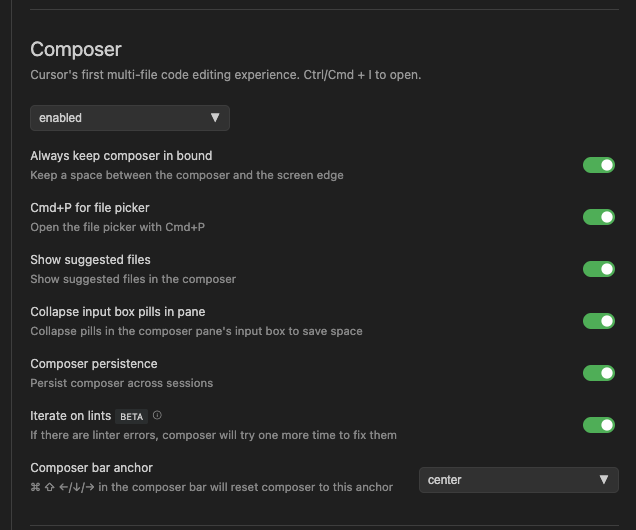
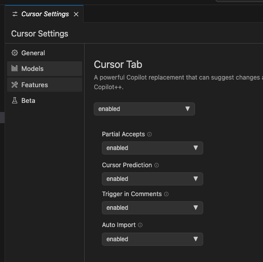

# 📕 第4章 Cursor のカスタマイズ設定

原稿を書き上げた後の変更点について補足説明します。

## 📘 4.3 Features 

### 📗 Docs

カスタム Docs のリスト内に再インデックスを行うボタン（回る矢印アイコン）が追加されました。実行すると、ドキュメントの最新情報にアクセスして、新しい情報のインデックスを構築します。

また、インデックスされた日付、時刻も表示されるようになりました。

### 📗 Composer

- enabled / disenabled：Composer のオン、オフの切り替え（デフォルト有効）
- Always keep composer in bound：フローティング Composer を移動してもウィンドウの四辺から一定の処理を保つようになります。
- Cmd+P for file picker：Composer 内で ⌘+P（macOS）またはCtrl+P（Windows）ショートカットキーでファイルピッカーを表示することができます。
- Show suggested files：Cursor が開くことを予測したファイルのリストが表示されます（薄い文字で表示されます）。
- Collapse input box pills in pane：入力ボックスのコード、テキストを折りたたみ表示してスペースを節約します。
- Composer persistence：Cursorの再起動をまたいで履歴を保存します。
- Iterate on lints (BETA)：lintエラーがある場合、コンポーザーは修正を再試行します。
- Composer bar anchor：フローティング Composer がデフォルト表示される位置を設定します（Left / Center / Right から選択）。

### 📗 Chat

- Narrow scrollbar：AIペインのチャットエリア右横のスクロールバーの横幅が小さくなります。
- Auto scroll chat：AIからの回答の長さに応じて自動的にスクロール表示します。その時プロンプト入力欄は下部に固定されます。

- Show chat history：プロンプト入力欄の下にチャット履歴が表示されます。

- Show suggested files：ファイルピッカーの右横にお勧めのファイルが表示されます（以下の図の右2つはお勧めされたファイル）。

### 📗 Cursor Tab

Copilot++ は Cursor Tab という呼称に変わりました。

- enabled / disabled：Cursor Tab の有効、無効を切り替えます。
- Partial Accepts：editor.action.inlineSuggest.acceptNextWordキーバインド（初期値→）を使用して、提案された次の単語を受け入れることができます。
- Cursor Prediction：Cursor Tab の提案を受け入れた後に移動する次の行を予測し、タブで受け入れることができます。
- Trigger in Comments：コメントで Cursor Tab の提案を有効または無効にする。
- Auto Import：Cursor Tab で必要なモジュールをインポートする（TypeScriptとPythonのみ対応）。

## 📘 4.4 ▼INTERPRETER MODE(BETA)

本書で何度もご紹介した Interpreter Mode は、0.40 からチャットモードのプルダウンで表示されなくなりました。廃止になったとの公式なアナウンスはありませんが、公式フォーラムで Interpreter Mode の不調に対して Composer で代替するアドバイスが Anysphere メンバーから付いていることから、廃止になった可能性があります。
Composer はファイルの作成ができるので、大きくなったファイルのモジュール分けなどのタスクは代替が可能です。一方、生成されたコードの実行を代替する手段はないため、Normal Chat モードで生成したコードをファイトして保存して手動で実行する操作が必要になります。

以降の章で、Interpreter Mode を使用している場面では、この点を踏まえてお読み替えください。

## 📘 4.5 Help

Help 機能は廃止されました。
使い方を質問する専用のチャットはなくなりましたが、AIペインの Normal Chat に質問することで使用方法についても回答を得られる場合があります。他に情報が見つからない時に有益な情報源ですが、この点はハルシネーションが多めで、回答をそのまま信じるのではなく、回答にもとづいて手元の動作で検証を行うことが大切です。
