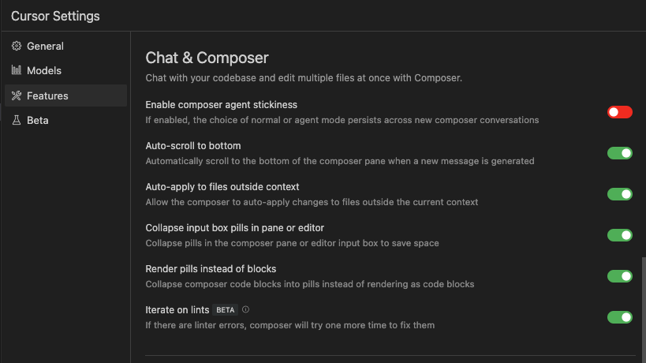

# 📕 第4章 Cursor のカスタマイズ設定

原稿を書き上げた後の変更点について補足説明します。

## 📘 4.3 Features 

### 📗 Docs

カスタム Docs のリスト内に再インデックスを行うボタン（回る矢印アイコン）が追加されました。実行すると、ドキュメントの最新情報にアクセスして、新しい情報のインデックスを構築します。

また、インデックスされた日付、時刻も表示されるようになりました。

### 📗 Chat & Composer🌟New🌟

Chat と Composer の設定が統合されました。
「コードベースとチャットし、コンポーザーで複数のファイルを一括で編集できます」

- Enable composer agent stickiness：コンポーザーエージェントの継続性を有効化（有効にすると、通常モードまたはエージェントモードの選択が新しいコンポーザーの会話でも維持されます）
- Auto-scroll to bottom：自動スクロール（新しいメッセージが生成された際、コンポーザーペインを自動的に最下部までスクロールします）
- Auto-apply to files outside context：コンテキスト外のファイルへの自動適用（コンポーザーによる変更を、現在のコンテキスト外のファイルにも自動適用することを許可します）
- Collapse input box pills in pane or editor：ペインまたはエディタの入力ボックスのピルを折りたたむ（スペースを節約するため、コンポーザーペインまたはエディタ入力ボックスのピルを折りたたみます）
- Render pills instead of blocks：ブロックの代わりにピルを表示（コンポーザーのコードブロックをコードブロックとして表示せず、ピルとして折りたたみます）
- Iterate on lints (BETA)：lintエラーがある場合、コンポーザーは修正を再試行します。

### 📗 Cursor Tab

Copilot++ は Cursor Tab という呼称に変わりました。

- enabled / disabled：Cursor Tab の有効、無効を切り替えます。
- Partial Accepts：editor.action.inlineSuggest.acceptNextWordキーバインド（初期値→）を使用して、提案された次の単語を受け入れることができます。
- Cursor Prediction：Cursor Tab の提案を受け入れた後に移動する次の行を予測し、タブで受け入れることができます。
- Trigger in Comments：コメントで Cursor Tab の提案を有効または無効にする。
- Auto Import：Cursor Tab で必要なモジュールをインポートする（TypeScript）。
- Auto Import for Python （Beta）：Cursor Tab で必要なモジュールをインポートする（Python）。

## 📘 4.4 ▼INTERPRETER MODE(BETA)

本書で何度かご紹介した Interpreter Mode は、0.40 からチャットモードのプルダウンで表示されなくなりました。

- Interpreter Mode はより強化された機能として、Composer の agent モードが実装されました。以降の章で、Interpreter Mode を使用している場面では、Composer agent をお使いください。Composer agent については、[第6章](../chapter6/README.md)の説明をご覧ください。

## 📘 4.5 Help

Help 機能は廃止されました。
使い方を質問する専用のチャットはなくなりましたが、AIペインの Normal Chat に質問することで使用方法についても回答を得られる場合があります。他に情報が見つからない時に有益な情報源ですが、この点はハルシネーションが多めで、回答をそのまま信じるのではなく、回答にもとづいて手元の動作で検証を行うことが大切です。
