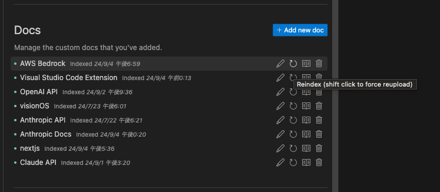
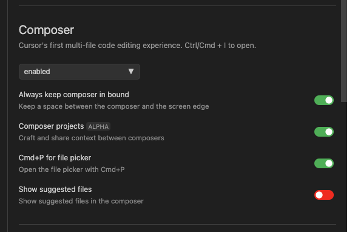
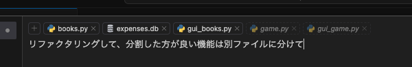
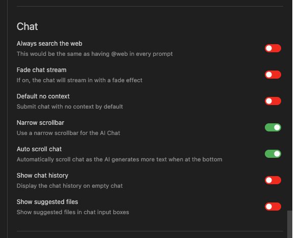
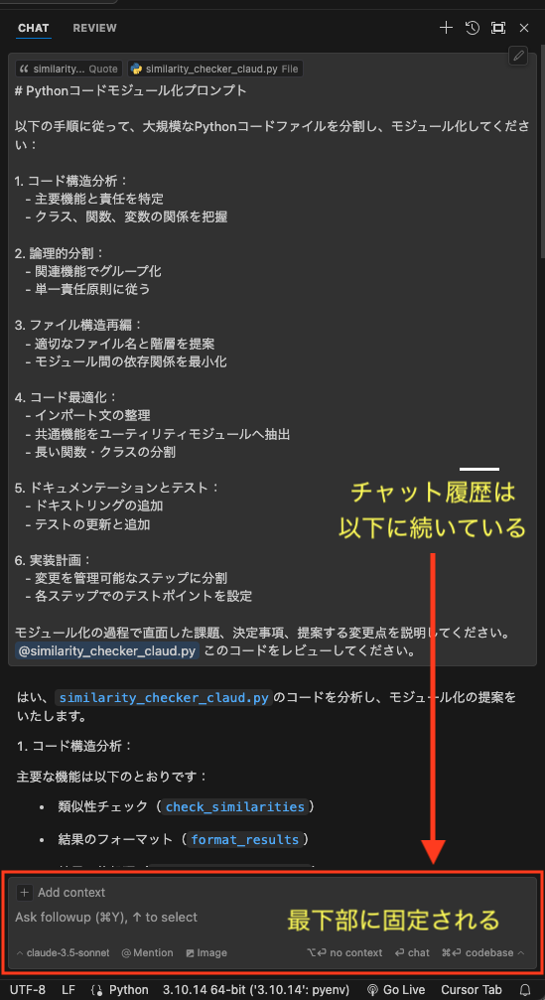
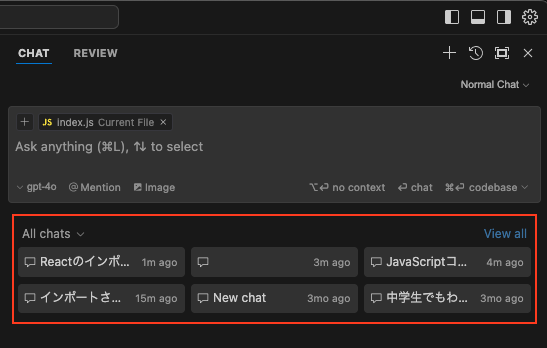

# 📕 第4章 Cursor のカスタマイズ設定

原稿を書き上げた後の変更点について補足説明します。

## 📘 4.3 Features 

### 📗 Docs

カスタム Docs のリスト内に再インデックスを行うボタン（回る矢印アイコン）が追加されました。実行すると、ドキュメントの最新情報にアクセスして、新しい情報のインデックスを構築します。

また、インデックスされた日付、時刻も表示されるようになりました。

### 📗 Composer

- enabled / disenabled：Composer のオン、オフの切り替え（0.40でデフォルト有効）
- Always keep composer in bound：オンにすると、Composer の四辺から一定の処理を保ちます。
- Composer projects：オンにすると、複数の Composer で履歴や資料ファイルを共有する project を使うことができます。
- Cmd+P for file picker：オンにすると、Composer 内で ⌘+P（macOS）またはCtrl+P（Windows）ショートカットキーでファイルピッカーを表示することができます。
- Show suggested files：オンにすると、ファイルピッカーの右横にお勧めのファイルが表示されます（以下の図の右2つはお勧めファイル）。

### 📗 Chat

- Narrow scrollbar：AIペインのチャットエリア右横のスクロールバーの横幅が小さくなります。
- Auto scroll chat：オンにすると、AIからの回答の長さに応じて自動的にスクロール表示します。その時プロンプト入力欄は下部に固定されます。

- Show chat history：オンにすると、プロンプト入力欄の下にチャット履歴が表示されます。

- Show suggested files：オンにすると、ファイルピッカーの右横にお勧めのファイルが表示されます（以下の図の右2つはお勧めされたファイル）。

## 📘 4.4 ▼INTERPRETER MODE(BETA)

本書で何度もご紹介した Interpreter Mode は、0.40 からチャットモードのプルダウンで表示されなくなりました。廃止になったとの公式なアナウンスはありませんが、公式フォーラムで Interpreter Mode の不調に対して Composer で代替するアドバイスが Anysphere メンバーから付いていることから、廃止になった可能性があります。
Composer はファイルの作成ができるので、大きくなったファイルのモジュール分けなどのタスクは代替が可能です、一方、生成されたコードの実行を代替する手段はないため、Normal Chat モードで生成したコードをファイトして保存して手動で実行する操作が必要になります。

以降の章で、Interpreter Mode を使用している場面では、この点を踏まえてお読み替えください。

## 📘 4.5 Help

Help 機能は廃止されました。
使い方を質問する専用のチャットはなくなりましたが、AIペインの Normal Chatに質問することで使用方法についても回答を得られる場合があります。
