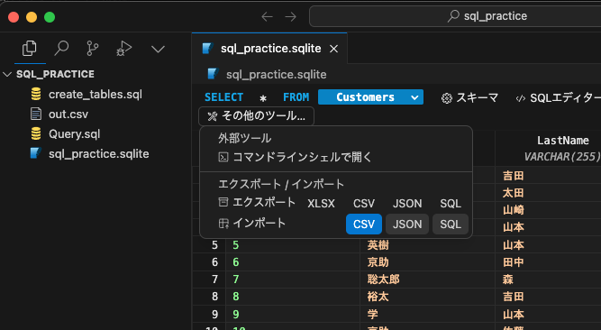

# 📕 第5章 プロンプト・プログラミング実践例

第5章の補足説明、ご紹介したプログラミング実践例で生成されたサンプルコードを掲載しています。

コードブロック右上にあるアイコンでコードをコピーすることができます。

- [プロンプト](PROMPT.md)はこちらに掲載されています。

## 📘 5.1 システム情報を表示するコマンド

<kbd>zsh</kbd>
```
top -l 1 | grep PhysMem | awk '{print "メモリ使用率: " $3}'; df -h | grep '/dev/disk1s1' | awk '{print "ローカルドライブの使用率: " $5}'; ifconfig | grep "inet " | grep -v 127.0.0.1 | awk '{print "IPアドレス: " $2}'
```

## 📘 5.2 画像の一括でのサイズ変更と別フォルダへの保存

P.137に下記のように説明しましたが、設定の「Rules for AI」（P.101掲載）に日本語で回答するルールが設定されていれば、「Debug with AI」ボタンを実行した回答が日本語で返るようになりました。

> 「Debug with AI」機能は「Please help me debug this code. Only debug the latest error.」プロンプトが自動送信されたチャットで、ワンアクションで回答が得られますが、英語表示になります。日本語での回答を得たい場合は「Add to Chat」ボタンを実行し、エラーメッセージを引用した状態のチャットで「説明」と入力して送信すれば、インストール手順が案内されます。案内された手順に従ってインストールを行ってください。

<kbd>zsh</kbd>
```
mogrify -resize 50% -format png -path resized *.png
```

- サンプルデータは [🔗こちら](sampledata/5.2_5.3/README.md) をお使いください。

## 📘 5.3 画像の一括形式変換、ファイル名変更、保存

<kbd>zsh</kbd>
```
for file in *.png; do convert "$file" "converted/${file%.png}_converted.jpg"; done
```

## 📘 5.4 PDF ファイルの結合

<kbd>zsh</kbd>
```
% for pattern in alphabet number symbol; do \
for> gs -q -dNOPAUSE -dBATCH -sDEVICE=pdfwrite -sOutputFile="${pattern}_converted.pdf" ${pattern}_*.pdf; \  
for> done
```

- サンプルデータは [🔗こちら](sampledata/5.4/README.md) をお使いください。


## 📘 5.5 テキストファイルの結合

<kbd>zsh</kbd>
```
cat a.txt b.txt c.txt > merged.txt
```

- サンプルデータは [🔗こちら](sampledata/5.5/README.md) をお使いください。

## 📘 5.6 ログファイルからエラー行を抽出して保存

<kbd>zsh</kbd>
```
grep 'ERROR:' app.log > errors.log
```

- サンプルデータは [🔗こちら](sampledata/5.6/README.md) をお使いください。

## 📘 5.7 CSV ファイルのデータ検証

<kbd>zsh</kbd>
```
awk -F, '
  NR==1 {
    expected_cols = NF
  }
  {
    if (NF != expected_cols) {
      printf "エラー: 行 %d の列数が期待される列数 %d と一致しません\n", NR, expected_cols
    }
    if ($1 == "" || $3 == "" || $5 == "") {
      printf "エラー: 行 %d の必須列（1, 3, 5）が空です\n", NR
    }
    if ($2 !~ /^[0-9]+$/) {
      printf "エラー: 行 %d の2列目の値 \"%s\" が整数ではありません\n", NR, $2
    }
    if ($4 !~ /^[0-9]{4}-[0-9]{2}-[0-9]{2}$/) {
      printf "エラー: 行 %d の4列目の値 \"%s\" が日付形式（YYYY-MM-DD）ではありません\n", NR, $4
    }
    if ($6 ~ /^0/) {
      printf "警告: 行 %d の6列目の値 \"%s\" が先頭に0を含んでいます\n", NR, $6
    }
  }
' data.csv
```

- サンプルデータは [🔗こちら](sampledata/5.7/README.md) をお使いください。

## 📘 5.8 大量ファイルの文字コード一括変換

<kbd>zsh</kbd>
```
find . -type f -name "*.txt" -exec sh -c 'mkdir -p SJIS; nkf -s -Lw "$1" > "/tmp/${1##*/}"; mv "/tmp/${1##*/}" "SJIS/${1##*/}"' _ {} \;
```

- サンプルデータは [🔗こちら](sampledata/5.8/README.md) をお使いください。

## 📘 5.9 生成されたコマンドのシェルスクリプト化

<kbd>zsh</kbd>
```
echo 'for file in *.png; do convert "$file" "converted/${file%.png}_converted.jpg"; done' > convert_images.sh && chmod +x convert_images.sh
```

## 📘 5.10 正規表現で日付の書式を統一

<kbd>hiduke.py</kbd>
```
import pandas as pd
from datetime import datetime
import re

# 和暦を西暦に変換する関数
def convert_japanese_era_to_gregorian(date_str):
    era_dict = {
        '令和': 2018,
        '平成': 1988,
        '昭和': 1925,
        '大正': 1911,
        '明治': 1867
    }
    match = re.match(r'([^\d]+)(\d+)年(\d+)月(\d+)日', date_str)
    if match:
        era, year, month, day = match.groups()
        year = int(year) + era_dict[era]
        return f'{year:04d}-{int(month):02d}-{int(day):02d}'
    return date_str

# 日付を統一フォーマットに変換する関数
def convert_to_standard_date_format(date_str):
    try:
        # 和暦の変換
        if re.search(r'[^\x00-\x7F]', date_str):
            date_str = convert_japanese_era_to_gregorian(date_str)
        
        # 日付のパースとフォーマット
        date_formats = [
            '%Y/%m/%d', '%Y-%m-%d', '%Y.%m.%d', '%B %d, %Y', '%Y年%m月%d日',
            '%d-%m-%Y', '%d.%m.%Y'
        ]
        for fmt in date_formats:
            try:
                return datetime.strptime(date_str, fmt).strftime('%Y-%m-%d')
            except ValueError:
                continue
        raise ValueError(f'Unknown date format: {date_str}')
    except Exception as e:
        print(f'Error converting date: {e}')
        return date_str

# CSVファイルの読み込み
df = pd.read_csv('hiduke.csv', header=None, names=['date', 'time', 'code'])

# 日付のフォーマットを統一
df['date'] = df['date'].apply(convert_to_standard_date_format)

# 結果の保存
df.to_csv('hiduke_converted.csv', index=False, header=False)
```

- サンプルデータは [🔗こちら](sampledata/5.10/README.md) をお使いください。

## 📘 5.11 CLI 三目並べPython プログラムをGolang に変換

<kbd>main.go</kbd>
```
package main

import (
	"fmt"
	"strings"
)

func printBoard(board [3][3]string) {
	for _, row := range board {
		fmt.Println(strings.Join(row[:], " | "))
		fmt.Println("---------")
	}
}

func checkWinner(board [3][3]string, player string) bool {
	winConditions := [8][3][2]int{
		{{0, 0}, {0, 1}, {0, 2}},
		{{1, 0}, {1, 1}, {1, 2}},
		{{2, 0}, {2, 1}, {2, 2}},
		{{0, 0}, {1, 0}, {2, 0}},
		{{0, 1}, {1, 1}, {2, 1}},
		{{0, 2}, {1, 2}, {2, 2}},
		{{0, 0}, {1, 1}, {2, 2}},
		{{2, 0}, {1, 1}, {0, 2}},
	}

	for _, condition := range winConditions {
		if board[condition[0][0]][condition[0][1]] == player &&
			board[condition[1][0]][condition[1][1]] == player &&
			board[condition[2][0]][condition[2][1]] == player {
			return true
		}
	}
	return false
}

func getEmptyPositions(board [3][3]string) [][2]int {
	var emptyPositions [][2]int
	for r := 0; r < 3; r++ {
		for c := 0; c < 3; c++ {
			if board[r][c] == " " {
				emptyPositions = append(emptyPositions, [2]int{r, c})
			}
		}
	}
	return emptyPositions
}

func startScreen() {
	fmt.Println("################################")
	fmt.Println("# 三目並べへようこそ！          #")
	fmt.Println("# 'X' と 'O' でプレイします。 #")
	fmt.Println("# ゲームのルール:              #")
	fmt.Println("# 3x3のグリッドに 'X' または 'O' を配置します。#")
	fmt.Println("# 同じ記号が縦、横、または斜めに3つ並ぶと勝ちです。#")
	fmt.Println("# ゲームを開始するには何かキーを押してください。 #")
	fmt.Println("################################")
}

func tictactoe() {
	startScreen()
	board := [3][3]string{{" ", " ", " "}, {" ", " ", " "}, {" ", " ", " "}}
	currentPlayer := "X"

	for {
		printBoard(board)
		emptyPositions := getEmptyPositions(board)
		if len(emptyPositions) == 0 {
			fmt.Println("引き分けです！")
			break
		}
		fmt.Printf("%sの番です。\n", currentPlayer)
		fmt.Print("行と列をスペースで区切って入力してください (例: 1 2): ")
		var row, col int
		fmt.Scanf("%d %d", &row, &col)
		if row >= 0 && row < 3 && col >= 0 && col < 3 && board[row][col] == " " {
			board[row][col] = currentPlayer
			if checkWinner(board, currentPlayer) {
				printBoard(board)
				fmt.Printf("おめでとうございます！ %sの勝ちです！\n", currentPlayer)
				break
			}
			if currentPlayer == "X" {
				currentPlayer = "O"
			} else {
				currentPlayer = "X"
			}
		} else {
			fmt.Println("無効な入力です。もう一度入力してください。")
		}
	}
}

func main() {
	tictactoe()
}
```

## 📘 5.12 PyGame オセロゲーム

<kbd>py3Othello.py</kbd>
```
import pygame
import sys

# ゲームの設定
BOARD_SIZE = 8
CELL_SIZE = 50
WINDOW_SIZE = BOARD_SIZE * CELL_SIZE

# 色の定義
BLACK = (0, 0, 0)
WHITE = (255, 255, 255)
GREEN = (0, 128, 0)
BLUE = (0, 0, 255)
RED = (255, 0, 0)

# オセロの盤面を初期化
def init_board():
    board = [[None] * BOARD_SIZE for _ in range(BOARD_SIZE)]
    board[3][3] = board[4][4] = BLACK
    board[3][4] = board[4][3] = WHITE
    return board

# 石を置ける位置を取得
def get_valid_moves(board, color):
    valid_moves = []
    for y in range(BOARD_SIZE):
        for x in range(BOARD_SIZE):
            if board[y][x] is None and is_valid_move(board, x, y, color):
                valid_moves.append((x, y))
    return valid_moves

# 石を置けるかチェック
def is_valid_move(board, x, y, color):
    if not (0 <= x < BOARD_SIZE and 0 <= y < BOARD_SIZE):
        return False
    if board[y][x] is not None:
        return False
    
    opponent_color = BLACK if color == WHITE else WHITE
    
    for dx, dy in [(0, 1), (1, 1), (1, 0), (1, -1), (0, -1), (-1, -1), (-1, 0), (-1, 1)]:
        nx, ny = x + dx, y + dy
        if 0 <= nx < BOARD_SIZE and 0 <= ny < BOARD_SIZE and board[ny][nx] == opponent_color:
            while True:
                nx += dx
                ny += dy
                if not (0 <= nx < BOARD_SIZE and 0 <= ny < BOARD_SIZE):
                    break
                if board[ny][nx] == color:
                    return True
                if board[ny][nx] is None:
                    break
    
    return False

# 石を反転
def flip_discs(board, x, y, color):
    opponent_color = BLACK if color == WHITE else WHITE
    
    for dx, dy in [(0, 1), (1, 1), (1, 0), (1, -1), (0, -1), (-1, -1), (-1, 0), (-1, 1)]:
        nx, ny = x + dx, y + dy
        if 0 <= nx < BOARD_SIZE and 0 <= ny < BOARD_SIZE and board[ny][nx] == opponent_color:
            while True:
                nx += dx
                ny += dy
                if not (0 <= nx < BOARD_SIZE and 0 <= ny < BOARD_SIZE):
                    break
                if board[ny][nx] == color:
                    while True:
                        nx -= dx
                        ny -= dy
                        if nx == x and ny == y:
                            break
                        board[ny][nx] = color
                    break
                if board[ny][nx] is None:
                    break

# ゲームの状態を描画
def draw_board(screen, board, valid_moves, current_player, game_over, winner):
    screen.fill(GREEN)
    for y in range(BOARD_SIZE):
        for x in range(BOARD_SIZE):
            rect = pygame.Rect(x * CELL_SIZE, y * CELL_SIZE, CELL_SIZE, CELL_SIZE)
            pygame.draw.rect(screen, BLACK, rect, 1)
            if board[y][x] == BLACK:
                pygame.draw.circle(screen, BLACK, (x * CELL_SIZE + CELL_SIZE // 2, y * CELL_SIZE + CELL_SIZE // 2), CELL_SIZE // 2 - 5)
            elif board[y][x] == WHITE:
                pygame.draw.circle(screen, WHITE, (x * CELL_SIZE + CELL_SIZE // 2, y * CELL_SIZE + CELL_SIZE // 2), CELL_SIZE // 2 - 5)
    
    for x, y in valid_moves:
        pygame.draw.circle(screen, GREEN, (x * CELL_SIZE + CELL_SIZE // 2, y * CELL_SIZE + CELL_SIZE // 2), 5)

    # 次の駒の打ち手を表示
    if not game_over:
        font = pygame.font.Font(None, 36)
        text = font.render("Next: " + ("Black" if current_player == BLACK else "White"), True, BLUE)
        screen.blit(text, (10, WINDOW_SIZE - 30))

    # 勝者を表示
    if game_over:
        font = pygame.font.Font(None, 36)
        text = font.render("Winner: " + ("Black" if winner == BLACK else "White"), True, RED)
        screen.blit(text, (WINDOW_SIZE // 2 - 50, WINDOW_SIZE // 2 - 20))

    # 終了ボタンを表示
    if game_over:
        pygame.draw.rect(screen, RED, (WINDOW_SIZE // 2 - 50, WINDOW_SIZE // 2 + 20, 100, 40))
        text = font.render("Quit", True, WHITE)
        screen.blit(text, (WINDOW_SIZE // 2 - 20, WINDOW_SIZE // 2 + 30))

# ゲームのメイン処理
def main():
    pygame.init()
    screen = pygame.display.set_mode((WINDOW_SIZE, WINDOW_SIZE))
    pygame.display.set_caption("Othello")
    
    board = init_board()
    current_player = BLACK
    font = pygame.font.Font(None, 36)
    game_over = False
    winner = None

    while True:
        valid_moves = get_valid_moves(board, current_player)
        
        for event in pygame.event.get():
            if event.type == pygame.QUIT:
                pygame.quit()
                sys.exit()
            elif event.type == pygame.MOUSEBUTTONDOWN:
                if game_over:
                    x, y = event.pos
                    if WINDOW_SIZE // 2 - 50 <= x <= WINDOW_SIZE // 2 + 50 and WINDOW_SIZE // 2 + 20 <= y <= WINDOW_SIZE // 2 + 60:
                        pygame.quit()
                        sys.exit()
                elif valid_moves:
                    x, y = event.pos
                    col = x // CELL_SIZE
                    row = y // CELL_SIZE
                    if (col, row) in valid_moves:
                        board[row][col] = current_player
                        flip_discs(board, col, row, current_player)
                        current_player = WHITE if current_player == BLACK else BLACK
        
        # ゲームの終了条件をチェック
        if not valid_moves:
            current_player = WHITE if current_player == BLACK else BLACK
            valid_moves = get_valid_moves(board, current_player)
            if not valid_moves:
                game_over = True
                black_count = sum(row.count(BLACK) for row in board)
                white_count = sum(row.count(WHITE) for row in board)
                if black_count > white_count:
                    winner = BLACK
                elif white_count > black_count:
                    winner = WHITE

        draw_board(screen, board, valid_moves, current_player, game_over, winner)
        pygame.display.flip()

if __name__ == "__main__":
    main()
```

## 📘 5.13 Web スクレイピング

<kbd>scrape_e_stat.py</kbd>
```
import requests
from bs4 import BeautifulSoup
import csv

# URLの設定
url = 'https://www.e-stat.go.jp/whats-new'

# ウェブページの取得
response = requests.get(url)
response.raise_for_status()  # エラーチェック

# BeautifulSoupでHTMLを解析
soup = BeautifulSoup(response.text, 'html.parser')

# 要素の抽出
dates = soup.find_all('span', class_='stat-newinfo-day')
organizations = soup.find_all('span', class_='stat-newinfo-kikan')
contents = soup.find_all('span', class_='stat-newinfo-comment')

# CSVファイルの作成
with open('estat_data.csv', mode='w', newline='', encoding='utf-8') as file:
    writer = csv.writer(file)
    writer.writerow(['公開（更新）日', '組織', '内容'])  # ヘッダーの書き込み

    # 結果の書き込み
    for date, organization, content in zip(dates, organizations, contents):
        if date.text.strip() != '公開（更新）日' and organization.text.strip() != '組織' and content.text.strip() != '内容':
            writer.writerow([date.text.strip(), organization.text.strip(), content.text.strip()])

```

## 📘 5.14 SQL データベースの操作と集計

<kbd>CREATE_TABLE.sql</kbd>
```
-- 顧客テーブル
CREATE TABLE Customers (
    CustomerID INT PRIMARY KEY,
    FirstName VARCHAR(50),
    LastName VARCHAR(50),
    Email VARCHAR(100)
);

-- 注文テーブル
CREATE TABLE Orders (
    OrderID INT PRIMARY KEY,
    CustomerID INT,
    OrderDate DATE,
    TotalAmount DECIMAL(10, 2),
    FOREIGN KEY (CustomerID) REFERENCES Customers(CustomerID)
);

-- 注文詳細テーブル
CREATE TABLE OrderDetails (
    OrderDetailID INT PRIMARY KEY,
    OrderID INT,
    ProductID INT,
    Quantity INT,
    UnitPrice DECIMAL(10, 2),
    FOREIGN KEY (OrderID) REFERENCES Orders(OrderID),
    FOREIGN KEY (ProductID) REFERENCES Products(ProductID)
);

-- 製品テーブル
CREATE TABLE Products (
    ProductID INT PRIMARY KEY,
    ProductName VARCHAR(100),
    UnitPrice DECIMAL(10, 2),
    UnitsInStock INT
);
```

【補足説明】
サンプルデータの作成で Interpreter Mode を使った手順をご紹介していますが、0.40 からチャットモードのプルダウンで Interpreter Mode が表示されない状態のため、チャットモードは「Normal Chat」を選択して、サンプルコードをCSVファイルとして生成する Python コードを作成、保存後、そのファイルを実行することができます。
作成された CSV ファイルは、「sql_practice.sqlite」データベースを選択して表示される SQLite3 Editor 拡張機能の画面から「その他のツール」→「インポート」で「CSV」を選択、CSVファイルを選択して、


<kbd>Query.sql</kbd>
```
SELECT
    c.FirstName || ' ' || c.LastName AS CustomerName,
    o.OrderID,
    o.OrderDate,
    o.TotalAmount,
    p.ProductName
FROM
    Orders o
JOIN
    Customers c ON o.CustomerID = c.CustomerID
JOIN
    OrderDetails od ON o.OrderID = od.OrderID
JOIN
    Products p ON od.ProductID = p.ProductID
WHERE
    o.OrderDate BETWEEN '2023-01-01' AND '2023-12-31'
    AND o.TotalAmount > 1000;
```


## 📘 5.15 iOS アプリ開発（Swift）

サンプルコードは下記のリポジトリからダウンロードしてご利用ください。
[「TipCalculator_ios」リポジトリ](https://github.com/kinopeee/TipCalculator_ios)

## 📘 5.16 Android アプリ開発（Flutter）

サンプルコードは下記のリポジトリからダウンロードしてご利用ください。
[「TipCalculator_flutter」リポジトリ](https://github.com/kinopeee/TipCalculator_flutter)
