# 📕 第6章 Cursor 開発テクニック

## 📘 追補 Composer

COMPOSER は CHAT と並んで AI ペインに表示されるようになりました。

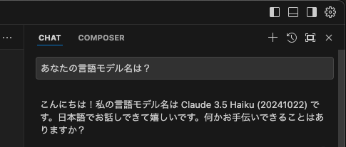

----

### Composer agent

COMPOSER では、normal / agent モードの切り替えができるようになりました。
   - normal：複数ファイル一括更新を行える（従来の）Composer の動作を行うモード
   - agent：一連のタスクの自律動作を行うエージェントモード

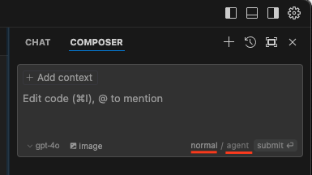

 Cmd(⌘)+.(ピリオド)のショートカットキーによって、モードの切り替えることが可能です。  

Composer agent の操作手順は以下のようになります。

1. agent 部分をクリック、またはショートカットキーで選択（ハイライト表示）されている状態にする。
2. プロンプトを入力。
3. submit ボタンをクリック（またはEnterキーをタイプ）。
4. Composer agent が自律処理を行います。
5. コマンドの実行が必要な場合はユーザに確認を求めてきます（セキュリティ担保のため）。
6. コマンドの実行内容を確認して「Run command」ボタンを実行します。
   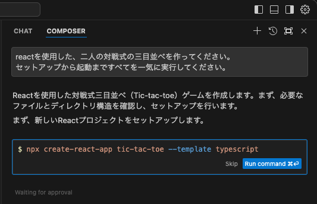
7. タスクを完了すると、自律処理を終了します。

書籍の Interpreter Mode を用いた操作の部分は Composer の agent で置き換えが可能です。
Interpreter Mode の「auto-execute」ボタンを実行する代わりに、Composer agent を使って操作を進めてください。
 
注）Composer agent は現時点では Anthropic モデル（Claude）のみをサポートしています（他のモデルだと「Unsupported model」表示となります）。

----

### Composer Notepads

0.41 で Composer のコントロールパネルに「Composer Notepads」機能が追加されました（0.40 で Projects と呼ばれていた機能を置き換えるものです）。

「Notepads」を作ると、そのプロジェクトに属する複数の Composer 間、さらには CHAT 間まで、参照ファイルやプロンプト履歴の内容を共有することができます。

操作は、以下の手順となります。

1. 左側のサイドバー（エクスプローラービュー）の最下部「NOTEPADS」セクションをクリックします。
   
   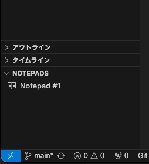

2. 「NOTEPADS」セクションにカーソルを合わせると表示される＋をクリックします。
   
   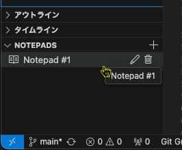

3. 「Type your thoughts, use @ to mention files」欄にプロジェクトのカスタムインストラクション、参照したいファイルを @ 記号の指定で入力します。
   
   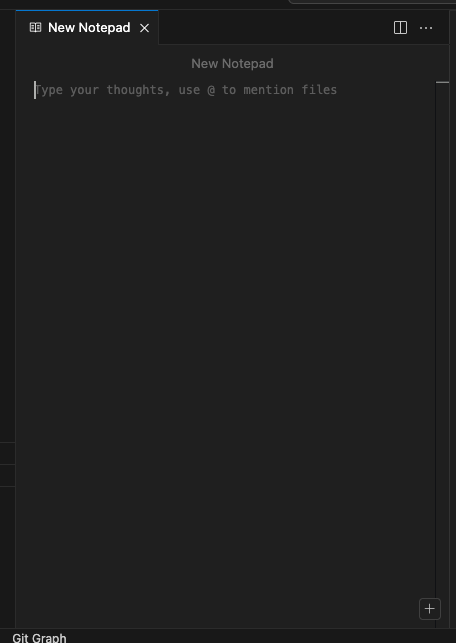

4. Notepads 画面右下の「Add context」の＋ボタンからファイルピッカーを呼び出して、参照ファイルを登録できます。
   
   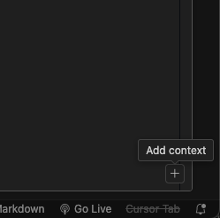

5. Notepads 名はウィンドウ上の鉛筆アイコンをクリックして、変更することができます。
   
   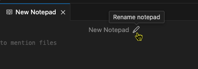

6. CHAT、COMPOSER から Notepads を参照するには、ファイルピッカーを使います。
   
   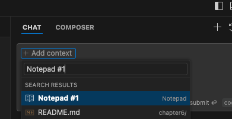

   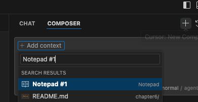 
   
   参照が設定された例
   
   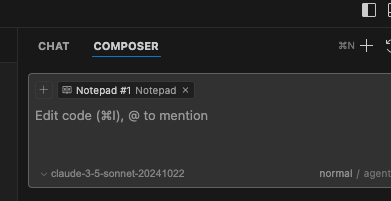 

----

### Composer の プロンプト再送信対応

0.42 でプロンプトの再送信に対応しました。送信済みプロンプト入力欄の横にある鉛筆アイコン（「Edit message」）をクリックすると、送信済みプロンプト欄にカーソルが入ります。必要な編集、モデル選択などを行ってから、プロンプトを再送信できます（送信済みプロンプト入力欄をクリックするだけでも編集可能になります）。

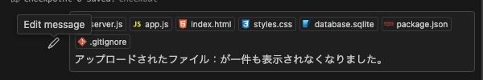

----

### 0.41 その他の変更点

- Composer とチャットが複数の画像を添付したプロンプトに対応しました。
- Composer の「Diff vlew」画面でコードの編集が可能になりました。
- Composer を Esc キーで閉じることができます（Composer が選択されていない時は、⌘+i、または Ctrl+i キーで選択し直してから実行）。

### 0.42 その他の変更点

- Composer チャット履歴も永続的に保存されるようになりました（Cursor再起動後も以前の履歴が失われない）。

### 0.43 その他の変更点 🌟New🌟

- Gitコミットメッセージの生成：ソース管理画面のコミットメッセージ欄の右横に星形アイコンが追加され、クリックすると AI が更新内容からコミットメッセージを生成されるようになりました。
  
  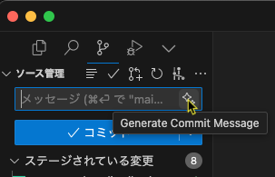

  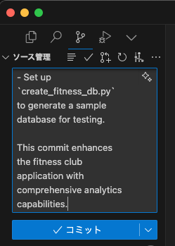 
  
----

驚くべき速度で進化を続ける Cursor。著者はサンフランシスコで開催された Cursor User Meetup（2024/7/16）に参加しましたが、Anysphere 開発陣はユーザのニーズに非常に敏感です。会う人、会う人に「Composerはどう？」、「何を改善して欲しい？」と質問を受けました。日本の Cursor ユーザの皆様も、公式フォーラムなどを通してニーズ情報を伝えて、より良い Cursor を作るコミュニティの一員になりましょう。

- [Cursor Community Forum - The official forum to discuss Cursor.](https://forum.cursor.com/)
