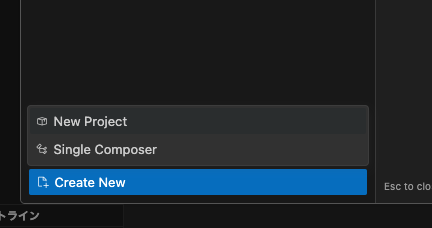
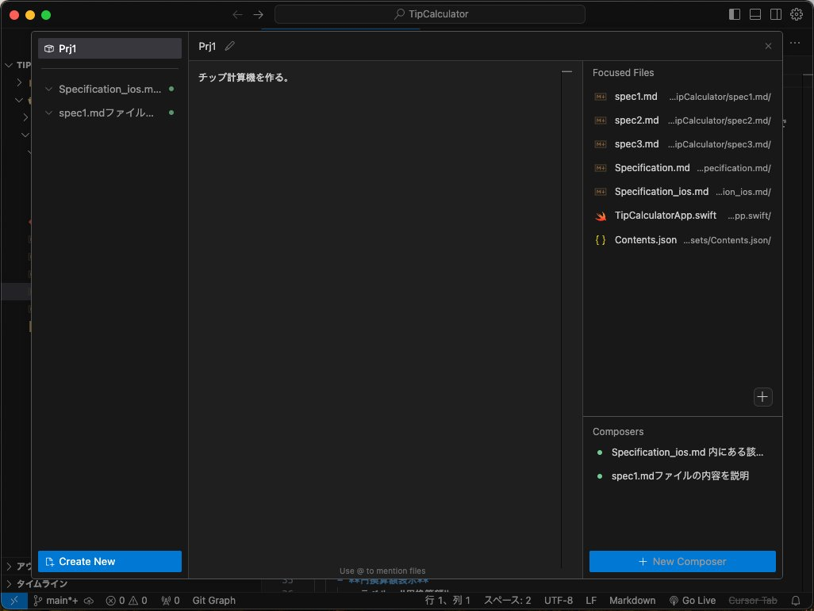
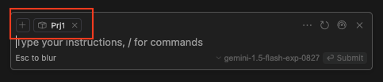

# 📕 第6章 Cursor 開発テクニック

## 📘 追補 Composer

0.40 で Composer のコントロールパネルに「Composer Projects (beta) 」機能が追加されました。

「Project」を作ると、そのプロジェクトに属する複数の Composer 間でプロンプト履歴や資料ファイルを共有できるものです。

操作は、以下の手順となります。

1. コントロールパネル左下の「Create New」ボタンをクリックします。

2. ポップアップされた選択肢から「New Project」をクリックします。
3. プロジェクト画面中央の「What do you want to build？」欄にプロジェクトの目的を入力します。
4. プロジェクト画面右上の「Focused Files」欄には、プロジェクト内で共有したい資料ファイルを指定します（左下の＋アイコンでファイルピッカーが表示されます）
5. 「Composers」欄の右下にある［+ New Composer］ボタンをクリックします。

6. プロジェクトに属する Composer が表示されます。この Composer は同じプロジェクト内の共有資料、他の Composer セッションの内容を参照することができます。

7. コントロールパネルを表示すると、プロジェクトに属する Composer は「Composers」欄内にリスト表示されます。

Composer は複数ファイルの一括更新が可能な、非常に強力な AI 機能である一方、Cursor を終了した時点で Project も Composer も履歴が消えてしまう、コントロールパネルがほぼ全画面を覆うモーダルウィンドウのため、ファイルや過去のチャット履歴を参照しながらの操作ができない、など改善が望まれる点もあります。作業の目的に応じて、AIペインの CHAT、Command+Kと上手に使い分けること良いでしょう。

驚くべき速度で進化を続ける Cursor。著者はサンフランシスコで開催された Cursor User Meetup（2024/7/16）に参加しましたが、Anysphere 開発陣はユーザのニーズに非常に敏感です。会う人、会う人に「Composerはどう？」、「何を改善して欲しい？」と質問を受けました。皆様からも、公式フォーラムなどを通してニーズ情報を伝えて、より良い Cursor を作るコミュニティの一員になりましょう。

- [Cursor Community Forum - The official forum to discuss Cursor.](https://forum.cursor.com/)
